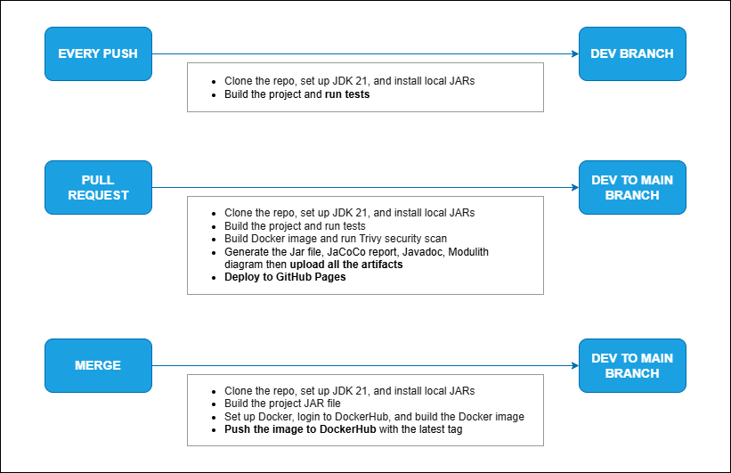
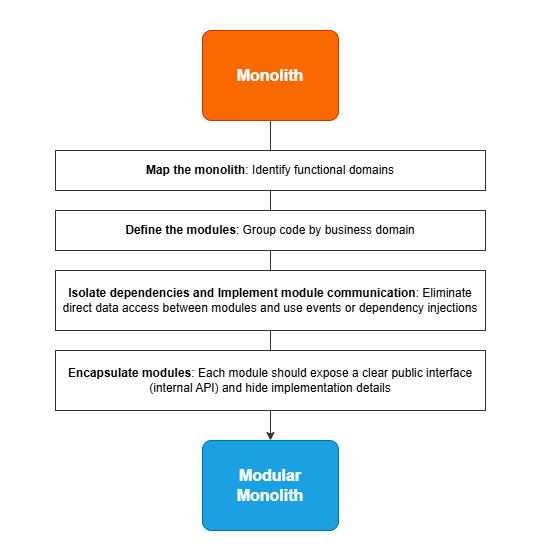
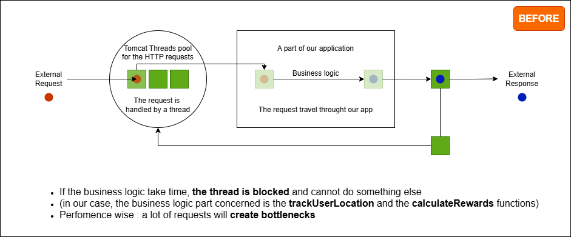
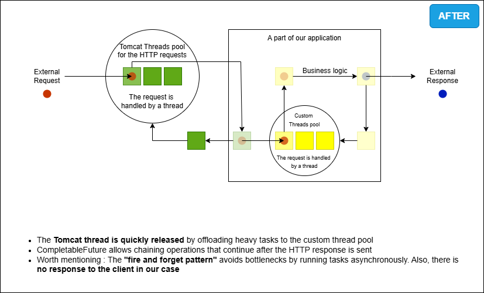
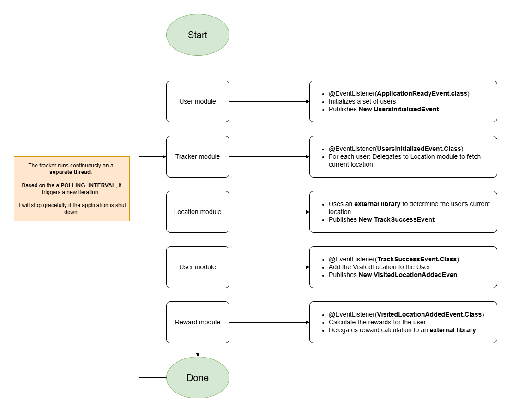

# ⚙️ CI/CD Pipeline

The project includes a fully operational **CI/CD pipeline** with the following features:


- 📐 **Architecture Diagram** - [Spring Modulith Components View](https://mr-boubakour.github.io/p8-DistributedSystems-spring-modulith/architecture-diagram.png)


- 🐳 **Docker Image Built** - [Dockerhub Repository](https://hub.docker.com/r/redikan7/tourguide_modulith/tags)


- 📊 **Code Coverage Reports** - [JaCoCo Report](https://mr-boubakour.github.io/p8-DistributedSystems-spring-modulith/jacoco/)


- 📚 **Documentation Generation** - [JavaDocs](https://mr-boubakour.github.io/p8-DistributedSystems-spring-modulith/javadocs/)


- 🔒 **Security Scanning** - Trivy vulnerability scanning for the Docker image of the app (Dependabot not used)



---

# 📄 Project Overview

**TourGuide** is a **Spring Boot** application that helps users plan their travels by discovering nearby tourist attractions and finding the best deals. By leveraging the user's current location, the app enables travelers to explore points of interest and earn rewards for visiting them.

(I revisited my final implementation of the Project 8 from OpenClassrooms' Java Developer Path in order to redesign it as a modular monolith, leverage event-driven mechanisms, and explore domain-driven design principles)

TourGuide uses a **Modular Monolithic architecture** built with **Spring Modulith**, which offers the following benefits:

- **Modular Monolithic Design**: The application is divided into well-defined modules, each responsible for a specific business domain.
- **Monolithic Deployment**: Simple, single unit deployment.
- **Modularity**: Clear separation of concerns, improving maintainability and scalability.
- **Improved Organization**: Better structure for the codebase and easier testing.

This combination allows the project to maintain simplicity in deployment while providing the advantages of modularity for long-term growth.



#### ⚡ Performance & Concurrency

To support high user volumes and ensure smooth user experience, TourGuide is designed with concurrency and scalability in mind:

- **Thread Pools** are used to handle background tasks such as periodic user tracking and reward processing without blocking main threads.
- **Asynchronous Execution (CompletableFuture)** allows the app to process multiple users in parallel, improving response time under load.
- **Event-Driven Architecture** ensures loose coupling between modules while enabling reactive, non-blocking workflows.

These strategies allowed the application to pass performance simulations with **100,000 concurrent users**, ensuring scalability and system stability under load.


##### Before (initially)

##### After (the final version)


---

# 🏛️ Architecture

### 🧩 Key Architectural Features

- **Modular Monolith Architecture**: Clear module boundaries with explicit dependencies
- **Event-Driven Communication**: Modules communicate through events
- **API Layers**: Each module exposes a well-defined API
- **Internal Implementation**: Module internals are encapsulated and not directly accessible from other modules

### 📦 Modular Structure

The application is organized into modules representing different business domains:

- **User Module**

initializes mock users at app startup for testing purposes and stores them in memory.
Listens to location-tracking events to update user history and emits follow-up events for rewards

- **Location Module**

retrieves user positions via an external GPS library and publishes an event.
Provides nearby attractions sorted by distance, with proximity detection logic

- **Reward Module**

listens to VisitedLocationAddedEvent and triggers async reward calculation. 
Uses location data to detect nearby attractions and fetches points from an external library

- **Tracker Module**

periodically fetches all users and updates their location using a background thread, triggered by a startup event

- **Trip Module**
  
calls an external pricing library via an adapter to calculate trip offers

- **Gateway Module**

Provides an API gateway that coordinates calls between modules without introducing circular dependencies, and includes a controller exposing the app's endpoints

---

# 🚀 Application behavior on launch



# ⚙️ Dependencies

The project uses the following key dependencies:

- **Spring Boot** 3.4.5
- **Spring Modulith** 1.3.5
- **Java** 21
- **MapStruct** – for object-to-object mapping
- **JaCoCo** – for code coverage

### 🔗 External Modules:

- `gpsUtil` – provides location tracking data
- `tripPricer` – generates trip deal offers
- `rewardCentral` – calculates reward points for visited attractions

```bash
mvn install:install-file -Dfile=./libs/gpsUtil.jar -DgroupId=gpsUtil -DartifactId=gpsUtil -Dversion=1.0.0 -Dpackaging=jar
mvn install:install-file -Dfile=./libs/RewardCentral.jar -DgroupId=rewardCentral -DartifactId=rewardCentral -Dversion=1.0.0 -Dpackaging=jar
mvn install:install-file -Dfile=./libs/TripPricer.jar -DgroupId=tripPricer -DartifactId=tripPricer -Dversion=1.0.0 -Dpackaging=jar
```

